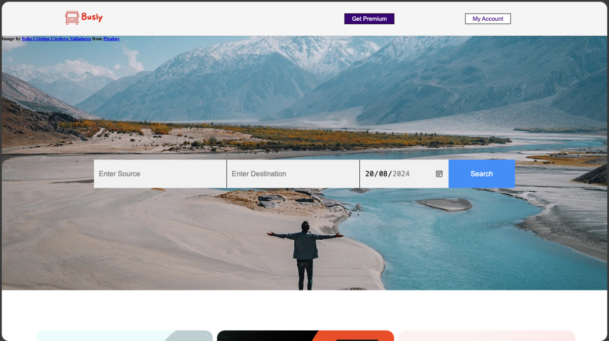
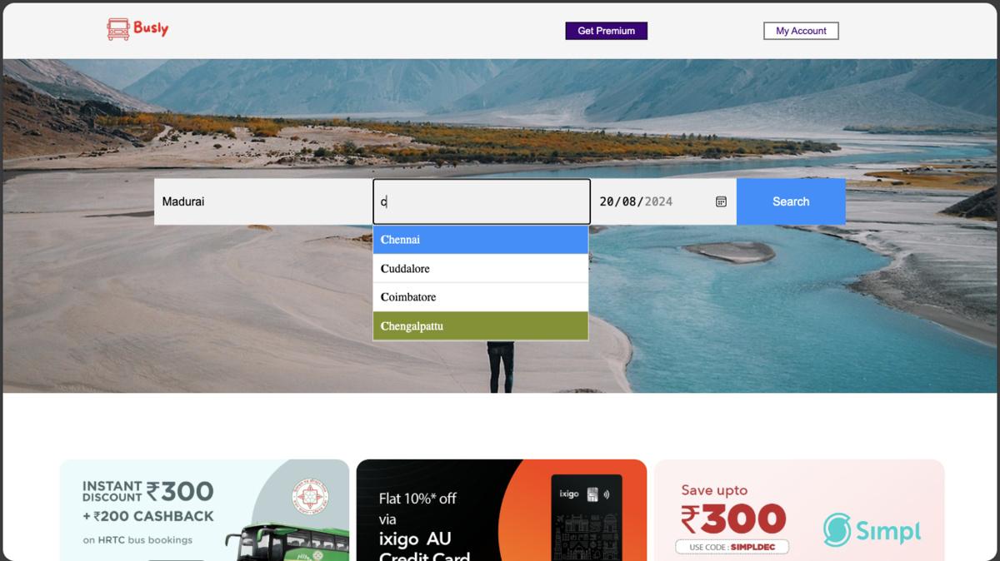
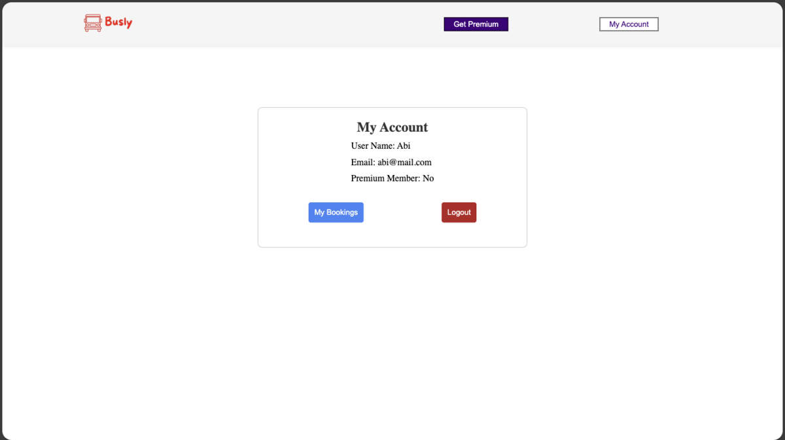
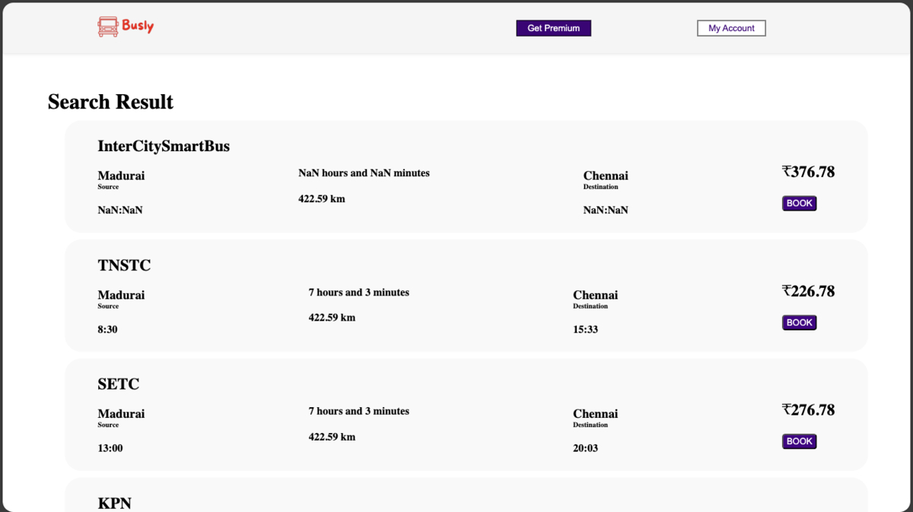
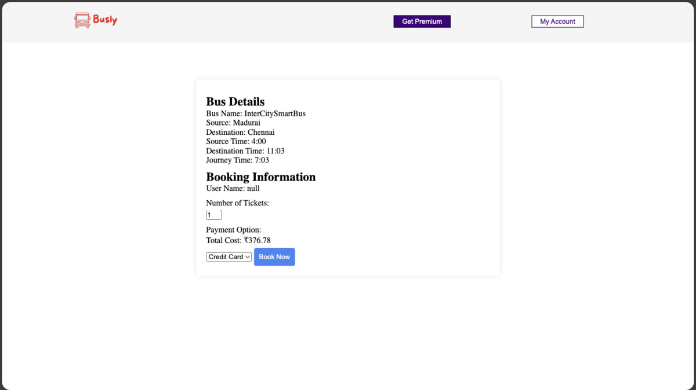
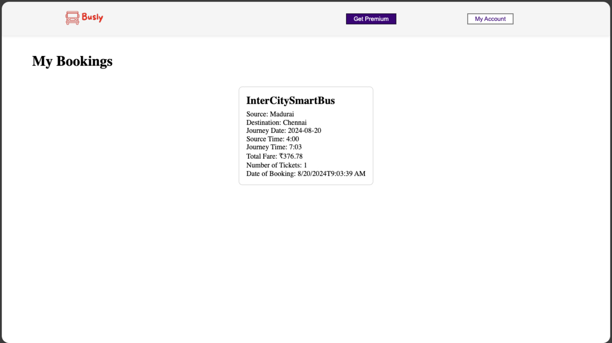

Here’s the updated version of the **BusApp** README, incorporating the new dependencies and other information you've provided:

---

# BusApp

Welcome to **BusApp**, a full-stack application designed to help users find bus routes, book tickets, and manage their bookings. This application consists of both a **client-side** and **server-side** implementation and is deployed on **Vercel**.

## Features

- **Bus Route Search**: Search for bus routes between various locations.
- **Booking System**: Users can book tickets and manage their reservations.
- **Authentication**: User login and registration functionality using Firebase.
- **Payment Integration**: Secure payment via Stripe for ticket purchases.

---

## Project Structure

```
📁busApp
├── 📁client
└── 📁server
```

- **`client`**: Contains the frontend code built with Svelte.
- **`server`**: Backend code that handles server-side logic, including API routes, Stripe integration, and Firebase authentication.

---

## Screenshots

Here are some screenshots of **BusApp** in action:













---

## Installation

To get started with **BusApp**, follow these steps:

### Prerequisites

- Node.js (>= v16)
- npm or yarn
- Firebase (for authentication)
- Stripe account (for payment integration)
- Vercel (for deployment)

### Setup

1. **Clone the repository**:

   ```bash
   git clone https://github.com/Abi-CP/busApp.git
   cd busApp
   ```

2. **Install dependencies** for both client and server:

   - For the **client-side**:

     ```bash
     cd client
     npm install
     ```

   - For the **server-side**:

     ```bash
     cd server
     npm install
     ```

3. **Configure environment variables**:

   - Create a `.env` file in the root directory for both the client and server.
   - Add your Firebase and Stripe keys to the `.env` file.

   Example `.env` for **client**:

   ```env
   VITE_FIREBASE_API_KEY=your_firebase_api_key
   VITE_STRIPE_PUBLIC_KEY=your_stripe_public_key
   ```

   Example `.env` for **server**:

   ```env
   FIREBASE_API_KEY=your_firebase_api_key
   STRIPE_SECRET_KEY=your_stripe_secret_key
   ```

4. **Run the development servers**:

   - Start the client:

     ```bash
     cd client
     npm run dev
     ```

   - Start the server:

     ```bash
     cd server
     npm run dev
     ```

5. Open your browser and visit [http://localhost:3000](http://localhost:3000) to view the app.

---

## Server-Side Configuration

The server-side is powered by **Node.js** and uses several key dependencies for handling requests, user authentication, and payments:

- **Express**: Web framework for building the server.
- **CORS**: For handling cross-origin requests.
- **dotenv**: For environment variable management.
- **firebase**: Firebase SDK for authentication.
- **Stripe**: Payment gateway for processing transactions.
- **geolib**: A library for geographical calculations.


## Deployment

**BusApp** is deployed on Vercel for seamless server-side and frontend integration. For deployment, follow these steps:

1. **Login to Vercel**: Sign in or create an account at [https://vercel.com](https://vercel.com).

2. **Link your repository** to Vercel.

3. **Configure environment variables** in the Vercel dashboard:

   - Add Firebase and Stripe environment variables for both frontend and backend.

4. **Deploy** the app.

Once deployed, you will get a live URL where the app is accessible to users.

---

## Contributing

Feel free to fork this repository, submit issues, or open pull requests. We welcome contributions to improve the app!

---

If you have any questions, feel free to reach out or open an issue in the repository!

---